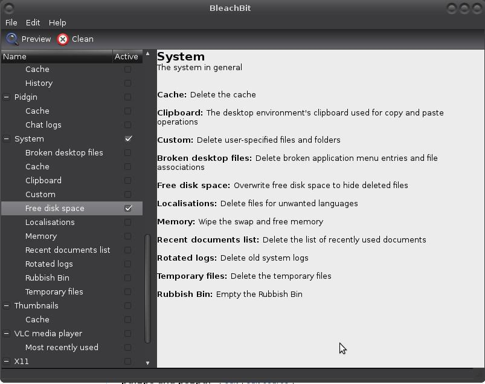

# Clean machine with BleachBit

With [BleachBit](https://www.bleachbit.org/features) you can free cache, delete cookies, clear Internet history, 
shred temporary files, delete logs, and discard junk you didn't even know was there. It is available for Linux, 
Windows, BlackBerry, Email servers and Mac OS X.

 
