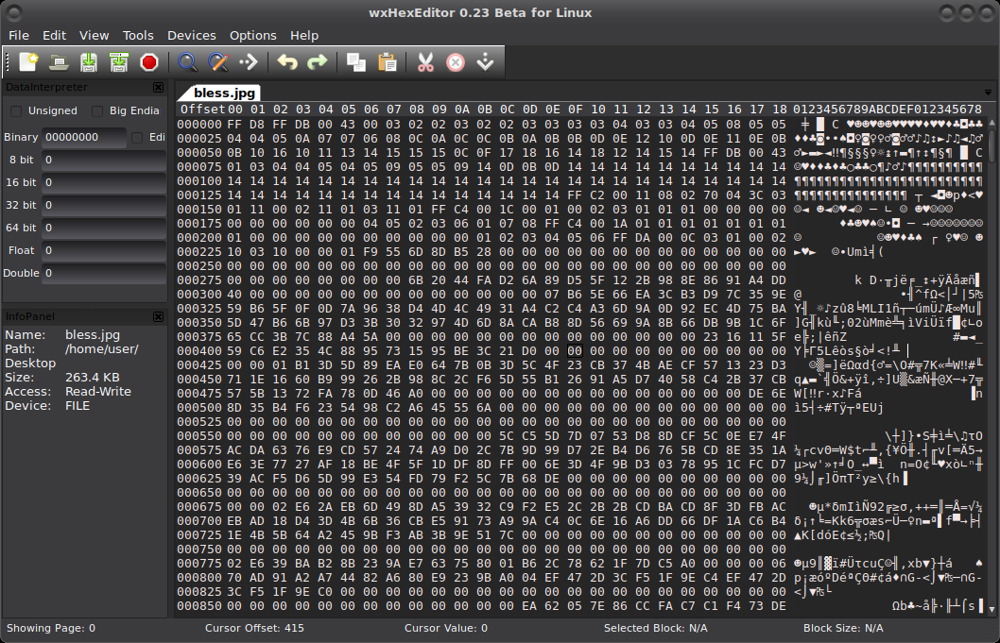

# Remove metadata with hex editors

The hexadecimal notation is almost universally used in computing - and not without a reason. There are sixteen hex digits - 0 to 9, and A to F (which correspond to decimal values 10 to 15), and each hex digit represents exactly four bits. Exactly two hex digits represent a byte, which can have a value from 00 to FF.

A hex byte is the only kind of object a computer handles, and hex bytes are used to represent anything. For example, a hex byte 50 may represent the capital letter P, the processor command push eax, the decimal number 80, a colour component with 50% brightness, or whatever else lives in the digital world.

And that means we have editors, hex editors, that can be used to view and change files, all files, on a very low level. As in, they can be used to remove metadata from any and all files. 

## Usage in general

* backup the file before using a hex editor on it.
* switch to ASCII mode, turn off “read only” mode, and start searching through the file.

For example, when scrubbing pdf’s from creation and modification information look through the entire file for “created” (metadata appears in the PDF file more than once). If and when you find metadata, change to fake data or delete. Then repeat your search again for the terms “create”, “creation”, “modified”, and “modify”, and similarly either replace or delete the dates, once again being sure to repeat each search so that any potential multiple instances of the field can be located and modified or blanked out. 

## Native

On Windows, open file Properties in Windows Explorer for each file. In the Details tab, click 
"Remove Properties and Personal information". Choose to "Remove the following properties from this file", 
select which metadata to remove, and press OK. There may still be other data though.

Windows do not have any pre-installed hex editor in their operating systems. Hex files can be stored in the text 
format or binary format. If you have a text-based hex file, then it can be opened with text editors like notepad.

## Using software

If you have a binary hex file, then the only option to open them is by using the third-party hex editing programs. 

* [HxD](https://mh-nexus.de/en/hxd/) Freeware Hex Editor and Disk Editor
* [Free Hex Editor Neo](https://www.hhdsoftware.com/free-hex-editor)

